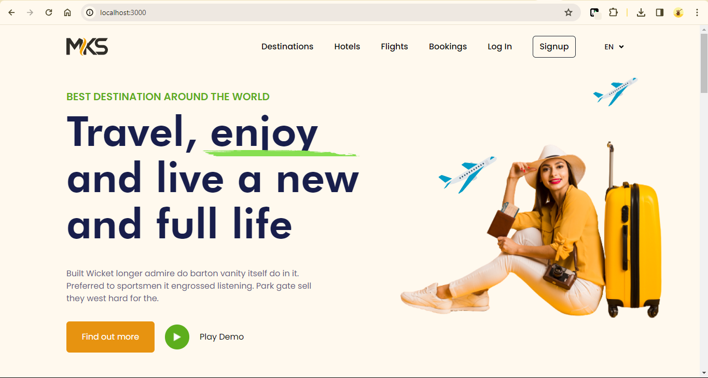

# Travel Agency Landing Page

## Getting Started

1. Clone the repository: `git clone https://github.com/sample-tayo/rayda.git`
2. Install dependencies: `npm install`
3. Run the development server: `npm run dev`

## Technology Stack

- Framework: [Next.js](https://nextjs.org/) - v14.0.3
- Animation: [Framer Motion](https://www.npmjs.com/package/framer-motion) - v10.16.5
- Styling: Tailwind CSS

## Dependencies

- [Framer Motion](https://www.npmjs.com/package/framer-motion) - v10.16.5
- [Next.js](https://nextjs.org/) - v14.0.3
- [React](https://reactjs.org/) - v18
- [React DOM](https://reactjs.org/docs/react-dom.html) - v18
- [React Icons](https://react-icons.github.io/react-icons/) - v4.12.0
- [React Infinite Logo Slider](https://www.npmjs.com/package/react-infinite-logo-slider) - v1.0.13

## Features

- MKS Logo
- Navigation Links (Destinations, Hotels, Flights, Bookings, Log In, Signup, EN)
- Tagline: "BEST DESTINATION AROUND THE WORLD - Travel, enjoy, and live a new and full life."
- Services
  - Calculated Weather
  - Best Flights
  - Local Events
  - Customization
- Top Selling Destinations
- Easy and Fast Booking Process
- Testimonials
  - Emily Adams from Lahore, Pakistan
  - Daniel Johnson from Lagos, Nigeria
  - Olivia Williams from Melbourne, Australia
- Subscription Section
- Footer with Company Information

## Folder Structure

project-root/
|-- .git/ # Git repository
|-- node_modules/ # Node.js modules
|-- public/ # Public assets (images, fonts, etc.)
| |-- assets/
| |-- avatar-1.jpg
| |-- avatar-2.jpg
| |-- icons/
| |-- google-play.svg
| |-- app-store.svg
|-- src/ # Source code
| |-- components/ # React components
| |-- Footer/
| |-- Footer.js
| |-- pages/ # Next.js pages
| |-- index.js
| |-- styles/ # CSS or styling files
| |-- tailwind.css
|-- .gitignore # Git ignore file
|-- next.config.js # Next.js configuration file
|-- package.json # Project dependencies and scripts
|-- README.md # Project README file
|-- tailwind.config.js # Tailwind CSS configuration file

## License

All rights reserved@mksstudios
